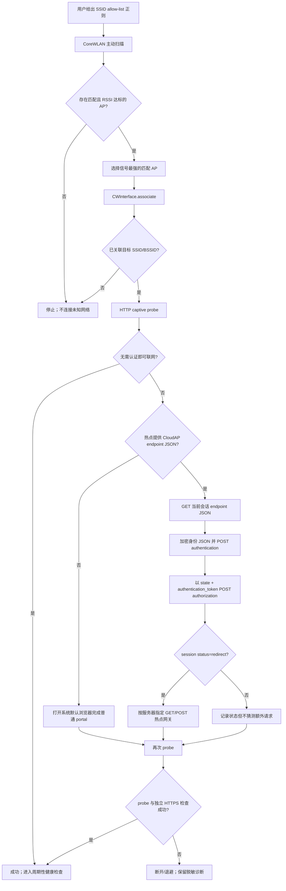
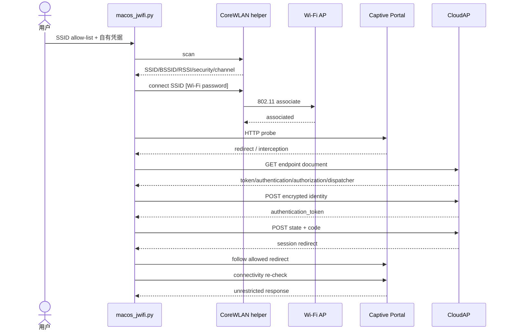

# macOS 核心功能落地说明

本文把现有 Android 静态结论收敛成可以在 Mac 上实施的 **扫描 AP → 连接 → captive
portal/CloudAP 认证 → 验证联网** 流程。仓库中的实现是获授权网络的研究 PoC，不是绕过
热点条款、付费或访问控制的工具。

## 最终连接方式（Mermaid）





## 获取 AP 列表

### 首选：CoreWLAN（已实现）

`macos/JWiFiCore.swift` 使用 `CWWiFiClient.shared().interface()` 获得默认 Wi-Fi 接口，
再调用 `CWInterface.scanForNetworks(withSSID:)`。输出是稳定、便于上层消费的 JSON：

```json
{
  "ok": true,
  "operation": "scan",
  "interface": "en0",
  "networks": [
    {"ssid": "Example", "bssid": "aa:bb:cc:dd:ee:ff", "rssi": -51,
     "channel": 36, "security": "wpa2Personal"}
  ]
}
```

构建和使用：

```bash
./macos/build.sh
./macos/jwifi-core scan
./macos/jwifi-core scan 'exact SSID'
./macos/jwifi-core current
./macos/jwifi-core connect 'SSID' 'WIFI_PASSWORD'
./macos/jwifi-core disconnect
```

扫描可能触发 macOS 的定位/隐私限制；签名、沙盒化发行版还必须在 Xcode target 中配置
对应能力与用途说明。不要解析菜单栏、`airport` 私有工具或 `system_profiler` 的本地化文本
作为主实现：它们不提供同等稳定的主动扫描契约。

### 选择策略

上层只连接用户给出的 `--ssid-regex` allow-list，丢弃低于 `--minimum-rssi` 的结果，并在
候选中取 RSSI 最大值。SSID 不是可信身份：恶意 AP 可以复制它。生产版应保存用户确认过
的安全类型/运营商信息，在安全类型降级、BSSID 异常或 portal TLS 身份变化时重新确认，
而不是无提示提交账号。

## 三层 API 清单

| 层 | API / 数据 | 用途 | 当前状态 |
| --- | --- | --- | --- |
| Wi-Fi | `CoreWLAN.CWWiFiClient` | 取得默认 Wi-Fi 接口 | Swift helper 已用 |
| Wi-Fi | `CWInterface.scanForNetworks(withSSID:)` / `scanForNetworks(withName:)` | 全量扫描/指定 SSID 扫描 | 已用 |
| Wi-Fi | `CWNetwork.ssid/bssid/rssiValue/wlanChannel/security` | AP 列表元数据 | 已输出 JSON |
| Wi-Fi | `CWInterface.associate(to:password:)` | 关联开放或 PSK 网络 | 已用，需在 Mac 实测 |
| Wi-Fi | `CWInterface.ssid()/bssid()/disassociate()` | 核对当前连接/断开 | 已用 |
| Portal | `urllib.request` + CookieJar | 保持 endpoint、认证、授权、redirect 同一 Cookie 会话 | 已用 |
| CloudAP | endpoint JSON | 动态 `token/authentication/authorization/dispatcher` | APK A 级证据；须从当前 WLAN 获取 |
| CloudAP | authentication JSON | AES-CBC envelope：`data/iv/apikey` | 已用 |
| CloudAP | authorization form | `state=<endpoint token>&code=<authentication_token>` | 已用 |
| CloudAP | session redirect | 按服务端 method/url/params 请求网关 | 已用 |
| Passpoint | `NEHotspotConfigurationManager` / configuration profile | 由 OS 安装、管理运营商配置 | 尚未实现；不能用 portal 请求等价替代 |

Apple 官方入口（实现时以本机 SDK 的 availability 为准）：

- [CoreWLAN framework](https://developer.apple.com/documentation/corewlan)
- [CWWiFiClient](https://developer.apple.com/documentation/corewlan/cwwificlient)
- [CWInterface](https://developer.apple.com/documentation/corewlan/cwinterface)
- [CWNetwork](https://developer.apple.com/documentation/corewlan/cwnetwork)
- [NetworkExtension](https://developer.apple.com/documentation/networkextension)
- [Captive Network](https://developer.apple.com/documentation/systemconfiguration/captive-network)

后两项不应被理解为“任意读取 Wi-Fi 信息/静默绕过 portal”的许可；实际可用性受 macOS
版本、entitlement、沙盒和用户授权共同约束。

## 运行端到端 PoC

凭据优先放环境变量，避免进入 shell history。认证仍默认 dry-run：

```bash
./macos/build.sh
export JWIFI_UUID='your-installation-uuid'
export JWIFI_LOGIN_ID='your-account'
export JWIFI_PASSWORD='your-password'
python3 -m poc.macos_jwifi \
  --ssid-regex '^\.Free Wi-Fi for Application$' \
  --endpoint-url 'http://portal-provided/current-session-endpoint.json'
```

先只检查 AP 选择：

```bash
python3 -m poc.macos_jwifi --ssid-regex 'authorized-pattern' --scan-only
```

只有在自有账号、获准热点、并确认 endpoint 属于当前连接会话时才增加
`--execute-auth`。`--wifi-password` 可用 `JWIFI_WIFI_PASSWORD` 替代。当前 PoC 输出不会
打印身份明文或 endpoint token，但子进程形式的 Wi-Fi 密码仍可能短暂出现在进程列表；
生产版必须改用 Keychain 和进程内 API，且日志做结构化脱敏。

## 仍需现场闭环的事项

1. **endpoint 发现**：目前必须显式提供 URL。需要在获准日本热点记录 Android 应用从
   captive probe/dispatcher 得到它的完整数据流，不能把某次短期 URL 硬编码。
2. **macOS 权限**：在目标 macOS 版本验证扫描结果是否隐藏 SSID/BSSID、是否出现定位
   提示，以及 Developer ID 签名与 App Sandbox 下所需 entitlement。
3. **连接成功判定**：关联成功不等于获得 DHCP/DNS/互联网。现场应分别记录接口、默认
   路由、DNS、纯 HTTP portal probe 和独立 HTTPS 请求。
4. **认证绑定**：验证 CloudAP 是按源 IP、MAC、Cookie 还是 token 绑定会话；Mac 的
   private Wi-Fi address 可能使 Android 抓到的会话完全不可复用。
5. **普通 portal**：false 分支应交给 `NSWorkspace.open`/默认浏览器，让用户完成同意、
   OAuth、验证码等交互；不要自动填写未知表单。
6. **Passpoint/OpenRoaming**：单独研究配置发放与系统安装。若依赖不可导出的 Android
   Keystore 证书或设备证明，则明确判定传统 Mac 移植不可行，而不是伪造客户端。
7. **恢复与生命周期**：实现指数退避、网络变化监听、睡眠唤醒重检、认证过期重登、用户
   手动断开尊重机制；任何失败都不能无限扫描或请求认证服务。

## 产品化分层建议

- `WiFiProvider`：CoreWLAN 扫描、关联、当前网络与变化事件；便于 mock 和单测。
- `CaptiveDetector`：只负责可审计的 HTTP/HTTPS 健康检查与 redirect 分类。
- `AuthenticationStrategy`：`NoAuth`、`BrowserPortal`、`CloudAP`、`Passpoint` 四种明确
  策略，绝不以 URL 猜测并混用凭据。
- `CredentialStore`：Keychain，账户和安装 UUID 不写配置文件或日志。
- `ConnectionCoordinator`：实现 Mermaid 状态机、取消、退避与用户确认。
- `Diagnostics`：记录时间、SSID 哈希、阶段和错误码；默认移除 BSSID、token、Cookie、
  精确位置和账号。

验收标准是：在至少两个获准热点上保存脱敏时间线，证明扫描、关联、DHCP、endpoint、
authentication、authorization、gateway redirect、最终 HTTPS 连通各阶段；任何只证明
`CWInterface.associate` 返回成功的结果都不能称为核心功能端到端完成。
